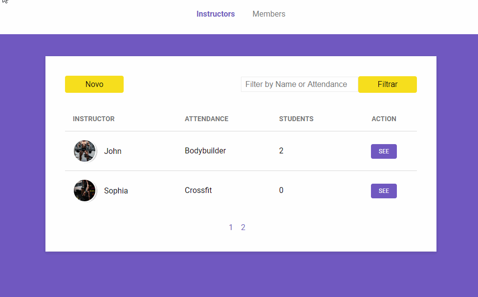
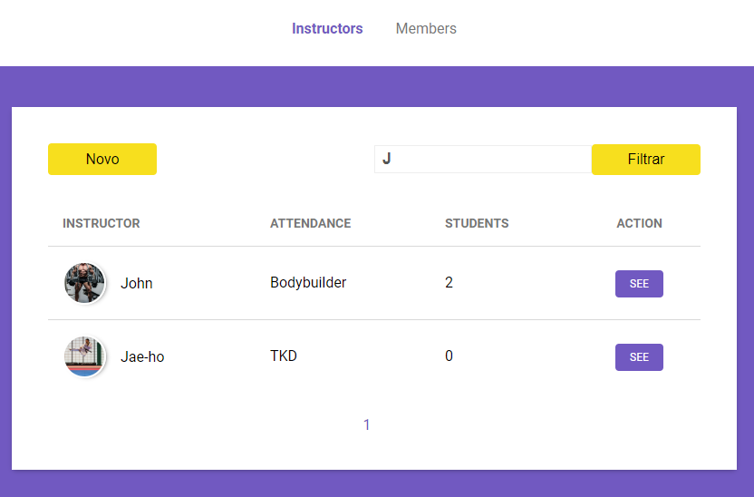
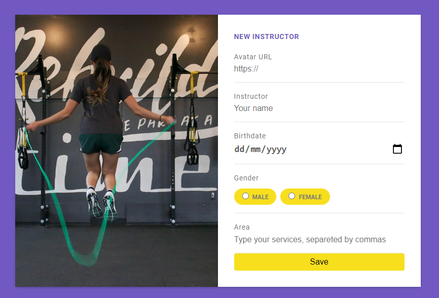

# Gym Manager 💪

A project to use nunjucks and the MVC standard (Rocketseat's LaunchBase 2.0 module)

## How to start 🏁

1. Clone this repository
1. Type the command `npm install` to update the project dependencies
1. Create a .env in the root directory like **.env.example file**
1. Type the command `npm start` to start your project
1. Open your nav on `localhost:5000`

That's it ✔

# Images and Gifs 🖼️

